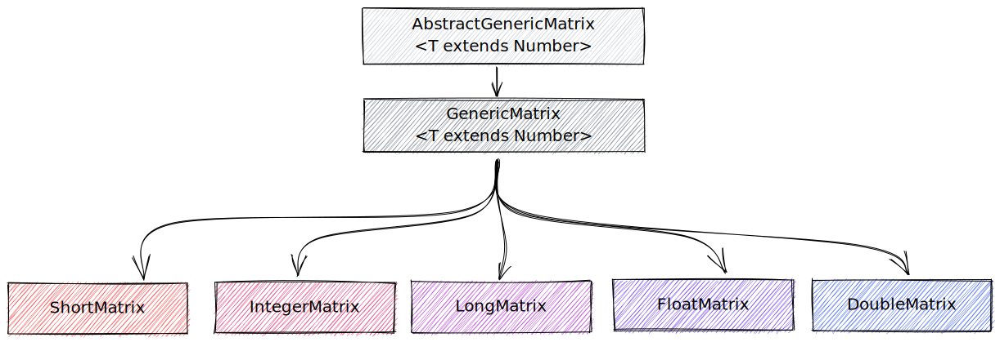

# JMATRIX | Java Matrix Library

JMatrix is a simple Java library which can be used to make basic linear algebra operations with matrices, or just to instantiate quickly Matrix-like data structures with generic or inferred types.

## Matrices
Matrices are handled using the following `<x>Matrix` class architecture


Thus the same `Matrix` can be instantiated in different ways:

### Instantiate a matrix
```java
    // Instantiate a 2x2 Short Matrix (default values = 0)
    GenericMatrix<Short> shortMatrix1 = new GenericMatrix<Short>(2,2);
    System.out.println(shortMatrix)1;

    ShortMatrix shortMatrix2 = new GenericMatrix<Short>(2,2);
    System.out.println(shortMatrix2);

    ShortMatrix shortMatrix3 = new ShortMatrix(2,2);
    System.out.println(shortMatrix3);
``` 


### Instantiate using a builder
Additionally, `JMatrix` offers a `Builder` class for `GenericMatrix`
```java
    // Instantiate a random, 3x3, DoubleMatrix using a Builder with values [-20, +20]
    DoubleMatrix doubleMatrix = new GenericMatrixBuilder<>(Double.class)
    .ofRandom(3, 3, -20, 20)
    .build();
```

## Operations
`JMatrix` supports different basic types of operations between matrices.  
Operations are exposed by the `MatrixOperations` class:
- transpose
- sum (addition by default, subtraction can be obtained through `scalar product` with -1)
- scalar product
- dot product
- hadamard
- min/max finding
- average calculation
- determinant calculation (optimizing for diagonals, triangolars, and using Laplace expansion)
- equality checking